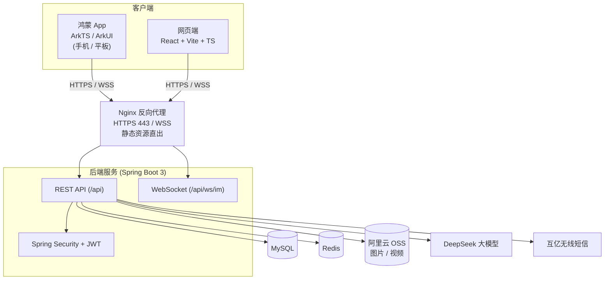

<div align="center">

# 心晴 · 心理健康社区（HarmonyOS + Web + 后端）

**一个集匿名社区、AI 心理咨询与好友即时通讯于一体的心理健康平台**

鸿蒙原生 App（ArkTS / ArkUI） · React 网页端 · Spring Boot 后端，三端共用一套 API。

-1B6FFF)


</div>

---

## 目录

- [项目简介](#项目简介)
- [整体架构](#整体架构)
- [仓库结构](#仓库结构)
- [功能特性](#功能特性)
- [技术栈](#技术栈)
- [快速开始](#快速开始)
  - [后端服务](#1-后端服务mental-healthbackend)
  - [鸿蒙 App](#2-鸿蒙-appmentalhealth)
  - [网页端](#3-网页端xsnbb-web)
- [接口概览](#接口概览)
- [生产部署](#生产部署)
- [常见问题（踩坑记录）](#常见问题踩坑记录)
- [运行截图](#运行截图)
- [路线图](#路线图)
- [许可证](#许可证)

---

## 项目简介

**心晴** 面向有情绪表达、同伴交流与心理咨询需求的青年群体，以「记录情绪、获得陪伴、寻求建议」为核心理念，提供三大核心场景：

- **心理社区**：发布与浏览图文动态，点赞、评论、关注、定位。
- **AI 心理咨询**：接入大模型的流式对话、历史会话与个性化知识库。
- **好友即时通讯**：基于 WebSocket 的实时私聊与通知推送。

平台由三端组成，**共用同一套后端 API 与数据**：鸿蒙原生 App、React 网页端、Spring Boot 后端。

---

## 整体架构



客户端经 Nginx（统一 HTTPS/WSS、静态资源直出）访问后端；后端基于 Spring Boot 提供 REST 与 WebSocket 服务，使用 MySQL 持久化、Redis 缓存验证码等、阿里云 OSS 存储媒体、DeepSeek 提供 AI 对话、互亿无线发送短信验证码。

---

## 仓库结构

```text
.
├── MentalHealth/        # 鸿蒙原生 App（ArkTS / ArkUI / DevEco Studio 工程）
│   └── entry/src/main/ets/
│       ├── pages/        # 主框架 Index（Tabs）
│       ├── view/         # community / ai / message / mine / auth / common 页面与组件
│       ├── api/          # HttpClient(rcp) · Api · WsClient
│       ├── store/        # Auth · AppTheme · AnnouncementStore
│       ├── utils/        # UploadUtil · LocationUtil · TimeUtil ...
│       ├── model/        # Models（TS 接口）
│       └── constants/    # Const（服务器地址等）
│
├── mental-health/
│   ├── backend/         # Spring Boot 后端（Maven 工程）
│   │   └── src/main/java/com/mental/health/
│   │       ├── controller/  # Auth/Post/Upload/Message/Ai/User/Admin/Announcement...
│   │       ├── service/     # 业务逻辑
│   │       ├── mapper/      # MyBatis-Plus Mapper
│   │       ├── entity/      # 实体
│   │       ├── websocket/   # ImWebSocketHandler · WsAuthInterceptor
│   │       ├── security/    # JwtFilter · JwtUtil · AdminInterceptor
│   │       └── config/      # Security / WebSocket / Mvc / 自动建表
│   └── deploy/          # nginx.conf · mental-health.service · DEPLOY.md
│
└── xsnbb-web/           # 网页端（React + Vite + TS + Tailwind + zustand）
    └── src/
        ├── pages/        # 社区 / AI / 消息 / 我的 / 管理员公告 等
        ├── components/   # TopNav · Toast · AnnouncementModal ...
        ├── api/          # http(fetch 封装) · index(接口集合)
        ├── store/        # auth(zustand persist)
        └── types/        # TS 类型
```

---

## 功能特性

| 模块 | 鸿蒙 App | 网页端 |
| --- | :---: | :---: |
| 账号密码 / 手机验证码登录、注册 | ✅ | ✅ |
| 社区动态浏览 / 发布图文 | ✅ | ✅ |
| 图片等比缩略图 + 全屏查看器（滑动、捏合/双击缩放） | ✅ | ✅ |
| 点赞 / 评论 / 关注 / 定位发帖 | ✅ | ✅ |
| AI 心理咨询（SSE 流式对话）+ 历史 + 知识库 | ✅ | ✅ |
| 好友即时通讯（WebSocket 实时）+ 未读提醒 | ✅ | ✅ |
| 资料编辑 / 头像上传 | ✅ | ✅ |
| **自定义 RGB 主题色（全局响应式换肤、持久化）** | ✅ | — |
| 系统公告弹窗（我知道了 / 不再显示 1 天） | ✅ | ✅ |
| 公告发布与管理（管理员） | — | ✅ |

---

## 技术栈

**鸿蒙 App（MentalHealth）**

| 类别 | 技术 |
| --- | --- |
| 语言 / UI | ArkTS · ArkUI 声明式 |
| SDK | HarmonyOS `compatibleSdkVersion 6.1.0(23)`，适配 phone / tablet |
| 网络 | RemoteCommunicationKit（rcp，HTTP）· NetworkKit（WebSocket） |
| 状态/持久化 | AppStorage · PersistentStorage · @State/@Prop/@Link/@StorageProp |
| 系统能力 | LocationKit（GPS）· SensorServiceKit（振动）· MediaLibraryKit（相册）· CoreFileKit |

**后端（mental-health/backend）**

| 类别 | 技术 |
| --- | --- |
| 框架 | Spring Boot 3.2.5 · Java 17 |
| 安全 | Spring Security · JWT（jjwt） |
| 持久层 | MyBatis-Plus · Druid · MySQL |
| 缓存 / 实时 | Redis · Spring WebSocket |
| 存储 / 三方 | 阿里云 OSS · DeepSeek（AI）· 互亿无线（短信）· Hutool |

**网页端（xsnbb-web）**

| 类别 | 技术 |
| --- | --- |
| 框架 | React 18 · TypeScript · Vite 5 |
| 样式 / 状态 | Tailwind CSS · zustand（持久化） |
| 路由 | react-router-dom 6 |

---

## 快速开始

> 前置：MySQL 8、Redis、JDK 17、Maven、Node 18+、DevEco Studio（鸿蒙）。

### 1. 后端服务（mental-health/backend）

```bash
cd mental-health/backend

# 1) 建库（MySQL），表会在启动时自动创建
#    CREATE DATABASE mental_health DEFAULT CHARSET utf8mb4;

# 2) 配置：复制并修改 application.yml 中的数据库、Redis、OSS、DeepSeek、短信等
#    数据源、jwt.secret、aliyun OSS、ai.deepseek.api-key、sms.ihuyi ...

# 3) 运行
mvn spring-boot:run
# 或打包后运行
mvn clean package -DskipTests
java -jar target/mental-health.jar --spring.profiles.active=prod
```

服务默认监听 `http://localhost:8080`，上下文路径 `/api`。

> 关键配置项：`spring.datasource`（MySQL）、`spring.data.redis`、`upload.oss.*`（OSS）、`ai.deepseek.api-key`、`sms.ihuyi.*`、`jwt.secret`。**请勿将真实密钥提交到仓库**，建议用环境变量注入。

### 2. 鸿蒙 App（MentalHealth）

1. 用 **DevEco Studio** 打开 `MentalHealth/` 工程。
2. 修改服务器地址：`entry/src/main/ets/constants/Const.ets`

   ```ts
   static readonly BASE_URL: string = 'https://你的域名/api';
   static readonly WS_URL:   string = 'wss://你的域名/api/ws/im';
   ```

   > 本地真机/模拟器联调可临时改为 `http://<服务器IP>/api` 与 `ws://<服务器IP>/api/ws/im`，并在 `network_config.json` 放行明文域名（上架须用 HTTPS）。
3. 连接真机或模拟器，点击 **Run** 构建安装。

所需权限（`module.json5`）：`INTERNET`、`GET_NETWORK_INFO`、`VIBRATE`、`LOCATION/APPROXIMATELY_LOCATION`。

### 3. 网页端（xsnbb-web）

```bash
cd xsnbb-web
npm install
npm run dev      # 本地开发（vite proxy 将 /api 转发到后端）
npm run build    # 生产构建，产物在 dist/
```

将 `dist/` 部署到 Nginx 站点根目录即可（与后端同域，API 走 `/api`）。

---

## 接口概览

基址：`https://xsnbb.xyz/api`（实时消息：`wss://xsnbb.xyz/api/ws/im`）。统一返回结构：

```json
{ "code": 0, "msg": "ok", "data": { } }
```

| 模块 | 方法与路径 | 说明 |
| --- | --- | --- |
| 认证 | `POST /auth/login` · `/auth/login/code` · `/auth/register` · `/auth/code` | 密码/验证码登录、注册、发送验证码 |
| 社区 | `GET /post/list` · `/post/{id}`；`POST /post/publish` · `/post/{id}/like` · `/post/{id}/comment` | 列表、详情、发布、点赞、评论 |
| 上传 | `POST /upload/image` · `/upload/video` | 多部分表单上传，返回 OSS URL |
| AI | `POST /ai/chat`（SSE 流式）· `GET /ai/sessions` | 流式对话、历史会话 |
| 用户 | `GET /user/profile`；`PUT /user/update`；`POST /user/{id}/follow` | 资料、修改、关注、好友 |
| 消息 | `WS /ws/im`（握手带 `?token=JWT`） | 实时私聊 / 通知推送 |
| 公告 | `GET /announcement/latest`；`POST /admin/announcements` | 拉取最新（公开）/ 发布（管理员） |

> 鉴权：除少量公开接口外，请求需在 `Authorization: Bearer <token>` 头携带 JWT；`/admin/**` 额外要求 `role=admin`。

---

## 生产部署

后端以 systemd 托管，Nginx 统一对外提供 HTTPS/WSS 与静态资源。要点（详见 `mental-health/deploy/`）：

1. **域名解析 + SSL**：域名 A 记录指向服务器，用 Let's Encrypt 申请证书，开启强制 HTTPS。
2. **安全组**：放行 `80`、`443`；后端 `8080` 仅本机访问（由 Nginx 反代）。
3. **Nginx 关键配置**：

   ```nginx
   server {
     listen 443 ssl;
     server_name xsnbb.xyz;
     client_max_body_size 200M;          # 媒体上传

     # 网页静态资源
     location / { root /www/wwwroot/xsnbb.xyz; try_files $uri $uri/ /index.html; }

     # WebSocket：必须带协议升级头
     location /api/ws/ {
       proxy_pass http://127.0.0.1:8080/api/ws/;
       proxy_http_version 1.1;
       proxy_set_header Upgrade $http_upgrade;
       proxy_set_header Connection "upgrade";
       proxy_read_timeout 600s;
     }
     # 其他 API
     location /api/ {
       proxy_pass http://127.0.0.1:8080/api/;
       proxy_set_header Host $host;
       proxy_set_header X-Forwarded-Proto $scheme;
     }
   }
   ```
4. **后端 systemd**（`mental-health.service`）：`ExecStart` 指向 `/www/wwwroot/mental-health/mental-health.jar`，`systemctl restart mental-health` 重启。

---

## 常见问题（踩坑记录）

| 现象 | 原因 | 解决 |
| --- | --- | --- |
| 真机无法连接服务器（`osErr:113`，连 443 失败） | 服务器只开了 80，App 走 HTTPS(443) | 配置域名 SSL 证书 + 放行安全组 443 |
| 消息不实时（`wsi is nullptr`） | Nginx 反代缺少 WebSocket 协议升级头 | 在 `/api/ws/` 增加 `Upgrade`/`Connection "upgrade"` |
| 真机图片上传失败（提示不支持的格式） | rcp 多部分表单未携带文件名 | `MultipartForm` 中设置 `remoteFileName` |
| 发帖图片一直「加载中」 | ArkUI `ForEach` 以下标为 key，列表项不刷新 | key 改为包含上传状态（如 `index-状态-url`） |
| 自定义主题色不全局生效 | 资源色为编译期常量，运行时不可变 | 引入响应式主题仓库 `AppTheme`，用 `@StorageProp` 订阅 |
| 部署后接口仍是旧逻辑 | systemd 跑的 jar 文件名/路径与上传的不一致 | 覆盖到 service 指定的 `mental-health.jar` 后 `systemctl restart` |

---

## 运行截图

> 将真机/网页运行截图放入 `docs/screenshots/` 后在此引用。

| 社区首页 | 全屏图片查看器 | AI 咨询 | 主题色定制 |
| --- | --- | --- | --- |
| _(截图)_ | _(截图)_ | _(截图)_ | _(截图)_ |

---

## 路线图

- [ ] 发帖支持视频上传与全屏播放
- [ ] 上传前图片等比压缩，优化流量与加载
- [ ] 引入分布式跨端协同与原子化服务
- [ ] 消息已读回执、图片消息
- [ ] 管理后台数据看板完善

---

## 许可证

本项目用于课程设计与学习交流，默认采用 **MIT License**。如需调整请修改本节与 `LICENSE` 文件。

> 注意：请确保仓库中不包含真实的数据库密码、JWT 密钥、OSS/AI/短信等敏感凭据，建议通过环境变量或 `application-local.yml`（加入 `.gitignore`）注入。
